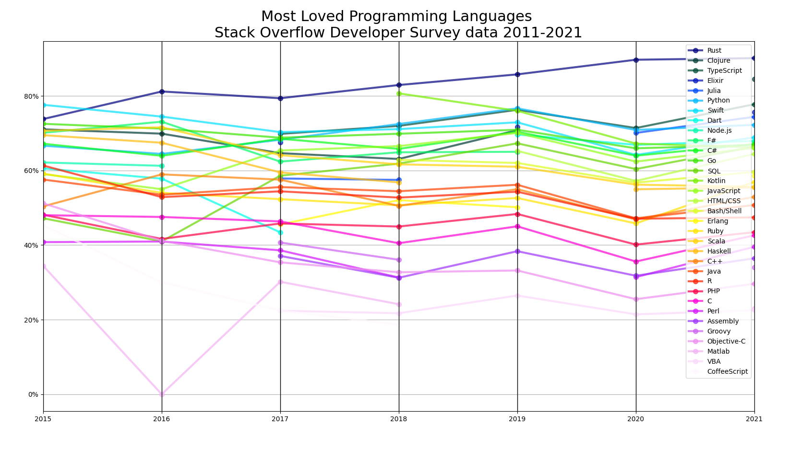

pyverflow graphs
-
Nicely (not yet though) displaying stackoverflow developer survey data since 2015 till 2022 (as of the time of writing)

### How to prepare data
1. Download all of the data from [here](https://insights.stackoverflow.com/survey)
2. Run `process_data.py`

### How to run 
`python main.py`